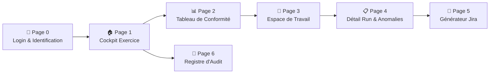
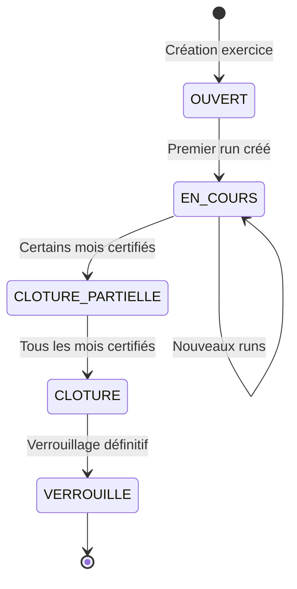
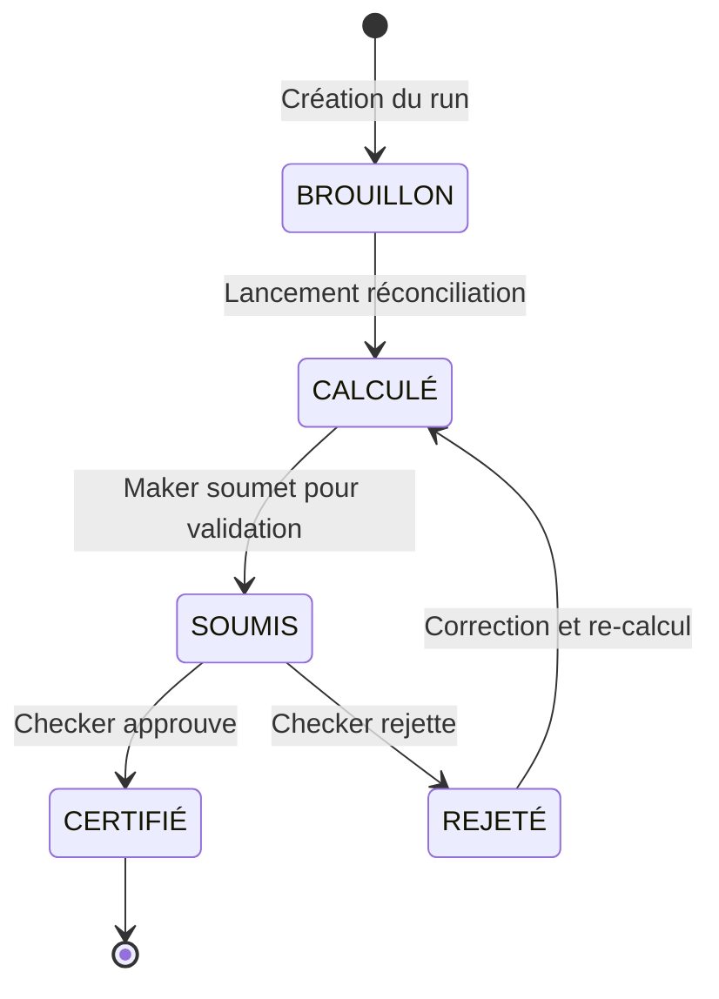
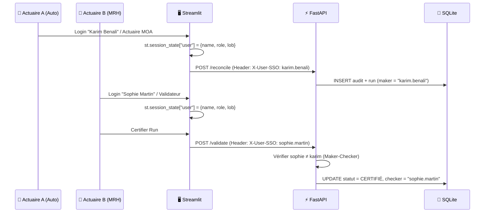
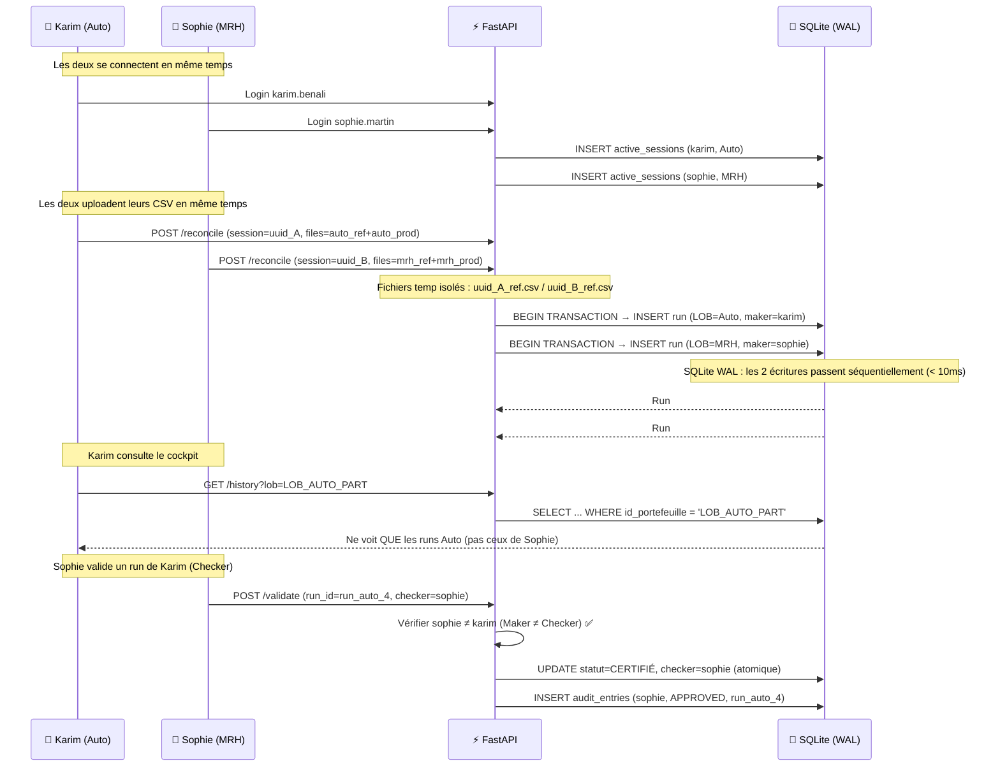

# 📐 Plan de Refonte Globale — ActuaRecette v2.2

> **Philosophie directrice** : La rigueur de Sage transposée au métier de l'actuaire MOA.
> Pas un tableau de bord de dataviz. Pas un ERP comptable. Un **outil de gouvernance de la recette actuarielle multi-utilisateur** — où chaque écran a une raison d'être, chaque chiffre est vérifiable, chaque action est traçable, et **une équipe entière d'actuaires peut travailler simultanément** sur des portefeuilles différents sans interférence.

> [!CAUTION]
> **Exigence fondamentale** : ActuaRecette doit supporter le travail simultané de plusieurs actuaires MOA sur des produits différents (Auto, MRH, Incendie…). Toute l'architecture — de l'identité utilisateur au verrouillage des données — doit être conçue pour le multi-utilisateur dès le départ. Ce n'est pas une fonctionnalité « Phase 4 » ; c'est un prérequis structurel.

---

## 1. Fondation : Vocabulaire et Métaphores Métier

> [!IMPORTANT]
> Le premier problème d'ActuaRecette aujourd'hui est un **problème d'identité**. Il emprunte à la comptabilité (Grand Livre, Balance, Lettrage) sans être un outil comptable, et au dashboard analytics (KPIs flashy, graphes) sans être un outil BI. Il faut choisir sa métaphore.

### 1.1 La bonne métaphore : le **Cahier de Recette Actuariel**

En MOA assurance, la recette fonctionne comme un **cahier de tests structuré** avec des exercices, des portefeuilles, des campagnes, des runs et des verdicts. Voici la transposition :

| Concept Sage (comptable) | Concept ActuaRecette (actuariel) | Signification |
|---|---|---|
| Exercice comptable | **Exercice de Recette** | Année de référence (2025, 2026) — verrouillable |
| Journal | **Cahier de Recette** | Un portefeuille/LOB (Auto, MRH, Incendie) |
| Écriture | **Campagne de Clôture** | Une période de test (ex : Clôture Juin 2026) |
| Pièce justificative | **Run d'Exécution** | Un passage de calcul (Run #1, #2, #3…) |
| Lettrage | **Réconciliation unitaire** | Le rapprochement prime-à-prime |
| Balance | **Tableau de Conformité** | Vue consolidée par LOB et période |
| Visa/Signature | **Certification Maker-Checker** | Validation réglementaire S2 |

### 1.2 Hiérarchie informationnelle stricte

```
Exercice 2026
├── 📁 LOB Automobile Particuliers (LOB_AUTO_PART)
│   ├── 📅 Clôture 2026-01
│   │   └── Run #1 → CERTIFIÉ 🟢 (100.0%)
│   ├── 📅 Clôture 2026-02
│   │   ├── Run #1 → BROUILLON ⬜ (94.2%) — rejeté, retour en brouillon
│   │   └── Run #2 → CERTIFIÉ 🟢 (100.0%)
│   ├── ...
│   └── 📅 Clôture 2026-06
│       ├── Run #1 → BROUILLON ⬜ (0.0%)
│       ├── Run #2 → CRITIQUE 🔴 (5.56%)
│       └── Run #3 → EN ATTENTE 🟡 (97.0%)
│
├── 📁 LOB Incendie & Risques Divers (LOB_INCENDIE_RD)
│   └── 📅 Clôture 2026-06
│       └── (aucune campagne) — [+ Créer une campagne]
│
└── 📁 LOB Habitation MRH (LOB_MRH_HAB)
    └── 📅 Clôture 2026-06
        └── (aucune campagne) — [+ Créer une campagne]
```

> Cette arborescence doit être **la colonne vertébrale** de toute la navigation. L'utilisateur sait toujours **où il se situe** : quel exercice, quel portefeuille, quelle période, quel run.

---

## 2. Architecture de Navigation — 8 Pages (7 initiales + 1 en Phase 2d)

Actuellement tout est dans un seul fichier monolithique de 168 Ko. La refonte doit découper en **7 pages Streamlit distinctes**, chacune avec un rôle précis (pattern recommandé : `st.navigation`).



### Page 0 — Login & Identification (nouveau)

**But** : Identifier l'actuaire qui se connecte. Sans identité, le workflow Maker-Checker, l'audit trail et le cloisonnement par rôle sont impossibles.

```
┌──────────────────────────────────────────────┐
│        🧪 ActuaRecette v2.0                  │
│                                              │
│   Identifiant SSO :  [karim.benali        ]  │
│   Rôle :             [Actuaire MOA      ▾ ]  │
│   LOBs assignés :    [☑ Auto  ☐ MRH  ☐ Inc] │
│                                              │
│   [Se connecter →]                           │
│                                              │
│   Utilisateurs connectés : 3                 │
│   • 🟢 Sophie Martin — Validateur — tous LOBs│
│   • 🟢 Jean Dupont — Actuaire — Incendie     │
│   • (votre session)                          │
└──────────────────────────────────────────────┘
```

**Les 3 profils utilisateur** :

| Profil | Qui ? | Ce qu'il voit | Ce qu'il peut faire |
|---|---|---|---|
| **Actuaire MOA** (Maker) | L'actuaire qui travaille au quotidien sur ses portefeuilles | **Uniquement ses LOBs assignés** (ex : Auto seulement) | Uploader CSV, lancer réconciliation, soumettre un run pour validation. **Ne peut pas** certifier ses propres runs. |
| **Validateur** (Checker) | Le pair ou manager qui certifie les travaux des autres | **Tous les LOBs** — vue consolidée + file de validations en attente | Inspecter n'importe quel run, certifier ou rejeter. **Ne peut pas** certifier un run qu'il a lui-même créé. |
| **Responsable MOA** (Manager) | Le responsable de l'équipe actuarielle | **Tous les LOBs** + activité de l'équipe + registre d'audit complet | Tout ce que le Validateur peut faire + verrouiller/déverrouiller un exercice + gérer les utilisateurs |

**Matrice de droits** :

| Action | Actuaire MOA | Validateur | Responsable MOA |
|---|---|---|---|
| Voir ses propres LOBs | ✅ | ✅ | ✅ |
| Voir tous les LOBs | ❌ | ✅ | ✅ |
| Uploader CSV + lancer réconciliation | ✅ | ✅ | ✅ |
| Soumettre un run pour validation | ✅ | ✅ | ✅ |
| Certifier / Rejeter un run (d'un autre) | ❌ | ✅ | ✅ |
| Voir la file de validations en attente | ❌ | ✅ | ✅ |
| Voir l'activité de toute l'équipe | ❌ | 🟡 Limité | ✅ |
| Verrouiller / Déverrouiller un exercice | ❌ | ❌ | ✅ |
| Supprimer un run | ✅ (ses propres) | ❌ | ✅ |
| Accéder au registre d'audit complet | ❌ | 🟡 Ses actions | ✅ |

**Implémentation** :
- **Phase 1 (minimum viable)** : écran Streamlit simple avec `st.text_input` pour le nom, `st.selectbox` pour le rôle, et `st.multiselect` pour les LOBs assignés. Stocké dans `st.session_state["user"]`. Pas de mot de passe (confiance réseau interne).
- **Phase future** : intégration SSO / LDAP Active Directory de l'entreprise.
- L'identité est **propagée dans chaque appel API** via les headers `X-User-SSO`, `X-User-Role`, et `X-User-LOBs`.
- L'API **vérifie les droits** à chaque requête : un Actuaire MOA ne peut pas appeler `GET /history?lob=MRH` s'il n'est assigné qu'à Auto.
- Le registre d'audit enregistre automatiquement **qui** fait **quoi**.

### Page 1 — Cockpit Exercice (vue adaptative par rôle)

**But** : L'écran d'accueil après le login. Son contenu **s'adapte au rôle** de l'utilisateur connecté.

| Élément | Actuel (problème) | Cible (refonte) |
|---|---|---|
| KPI « Dossiers Sains » | Affiche **−3 196** (incohérent) | Afficher le **nombre absolu** de dossiers conformes, jamais un delta brut comme valeur principale |
| Comparaison vs précédent | Delta affiché sans contexte | Afficher en **sous-texte** : « +3 244 vs Run #2 (5.56%) » avec lien vers le run de comparaison |
| Graphe « Taux de réconciliation » | Courbe mixant tous les LOBs | **Un sparkline par LOB** dans le tableau de conformité, pas un graphe global décontextualisé |
| Sélecteur de période | Boutons mois (Jan-Déc) en haut | OK mais **griser les mois non clôturés** et marquer ceux certifiés avec un badge ✅ |
| **Vue par rôle** | ❌ N'existe pas | Le Cockpit affiche un contenu **différent** selon le profil connecté |

---

#### Vue Maker (Actuaire MOA) — Cockpit focalisé sur ses LOBs

L'actuaire Maker ne voit que **ses LOBs assignés**. Son Cockpit est un espace de travail focalisé.

```
┌─────────────────────────────────────────────────────────────────┐
│  EXERCICE [2026 ▾]            👥 3 connectés   👤 Karim Benali │
│                                             Rôle : Actuaire MOA │
├─────────────────────────────────────────────────────────────────┤
│                                                                 │
│  📋 MON PORTEFEUILLE — Automobile Particuliers                   │
│  ┌──────────────────────────────────────────────────────────┐   │
│  │ CLÔTURE  │ DERNIER RUN │ TAUX      │ PRIME À  │ STATUT  │   │
│  ├──────────┼────────────┼───────────┼──────────┼─────────┤   │
│  │ 2026-05  │ Run #1     │ 100.00%   │   0.00€  │✅CERT.  │   │
│  │ 2026-06  │ Run #3     │  97.00%   │  88.59€  │🔶VISA   │   │
│  ├──────────┴────────────┴───────────┴──────────┴─────────┤   │
│  │ BILAN EXERCICE     │ 5/6 certifiés │ 99.50%  │ 88.59€  │   │
│  └────────────────────────────────────────────────────────┘   │
│                                                                 │
│  ┌──────────────────────────┐ ┌──────────────────────────────┐  │
│  │ PROGRESSION ANNUELLE     │ │ RÉPARTITION DES ANOMALIES    │  │
│  │ Jan ████████████ 100%    │ │ par catégorie actuarielle    │  │
│  │ Fév ████████████ 100%    │ │                              │  │
│  │ Mar ████████████ 100%    │ │ Jeune conducteur    ██ 3     │  │
│  │ Avr ████████████ 100%    │ │ CRM plancher        ██ 2     │  │
│  │ Mai ████████████ 100%    │ │ Coeff. puissance    █  1     │  │
│  │ Jun ██████████░░  97%    │ │ Arrondis tolérés    ████ 5   │  │
│  └──────────────────────────┘ └──────────────────────────────┘  │
└─────────────────────────────────────────────────────────────────┘
```

---

#### Vue Checker / Manager — Cockpit de supervision d'équipe

Le Validateur ou Responsable MOA voit **tous les LOBs**, la **file de validations en attente**, et l'**activité de l'équipe**.

```
┌─────────────────────────────────────────────────────────────────┐
│  EXERCICE [2026 ▾]            👥 3 connectés  👤 Sophie Martin  │
│                                              Rôle : Validateur  │
├─────────────────────────────────────────────────────────────────┤
│                                                                 │
│  ⚡ VALIDATIONS EN ATTENTE DE MON VISA (2)                       │
│  ┌──────────────────────────────────────────────────────────┐   │
│  │ 🚗 Auto   │ Run #4 │ 97.00% │ Soumis par Karim B.       │   │
│  │ le 03/06  │ 3 anomalies fatales │ 88.59€ à risque       │   │
│  │ [✅ Certifier]  [❌ Rejeter]  [👁️ Inspecter le détail]   │   │
│  ├──────────────────────────────────────────────────────────┤   │
│  │ 🏠 MRH    │ Run #1 │ 99.50% │ Soumis par Jean D.        │   │
│  │ le 03/06  │ 1 anomalie fatale  │ 12.30€ à risque        │   │
│  │ [✅ Certifier]  [❌ Rejeter]  [👁️ Inspecter le détail]   │   │
│  └──────────────────────────────────────────────────────────┘   │
│                                                                 │
│  📊 TABLEAU DE CONFORMITÉ — TOUS LES PORTEFEUILLES              │
│  ┌──────────┬────────┬──────────┬────────┬────────┬────────┐   │
│  │ PORTEFEU.│PÉRIODE │ DERNIER  │ TAUX   │PRIME À │ STATUT │   │
│  │          │        │ RUN      │CONFORM.│RISQUE  │ FINAL  │   │
│  ├──────────┼────────┼──────────┼────────┼────────┼────────┤   │
│  │ 🚗 Auto │2026-06 │ Run #4   │ 97.00% │ 88.59€ │🔶VISA  │   │
│  │          │        │ 🔬 Karim │        │        │        │   │
│  ├──────────┼────────┼──────────┼────────┼────────┼────────┤   │
│  │ 🔥 Incen.│2026-06 │ Run #2   │100.00% │  0.00€ │✅CERT. │   │
│  ├──────────┼────────┼──────────┼────────┼────────┼────────┤   │
│  │ 🏠 MRH  │2026-06 │ Run #1   │ 99.50% │ 12.30€ │🔶VISA  │   │
│  │          │        │ 🔬 Jean  │        │        │        │   │
│  ├──────────┴────────┴──────────┴────────┴────────┴────────┤   │
│  │ CONSOLIDÉ EXERCICE       │ 98.83%  │100.89€ │          │   │
│  └─────────────────────────────────────────────────────────┘   │
│                                                                 │
│  📋 ACTIVITÉ RÉCENTE DE L'ÉQUIPE                                │
│  ┌──────────────────────────────────────────────────────────┐   │
│  │ 14:25 │ Karim B. │ A soumis Run #4 Auto pour validation  │   │
│  │ 14:20 │ Jean D.  │ A soumis Run #1 MRH pour validation   │   │
│  │ 14:15 │ Karim B. │ A lancé une réconciliation sur Auto    │   │
│  │ 13:50 │ Jean D.  │ A uploadé les CSV MRH                 │   │
│  │ 13:30 │ Sophie M.│ A certifié Run #2 Incendie ✅          │   │
│  └──────────────────────────────────────────────────────────┘   │
└─────────────────────────────────────────────────────────────────┘
```

> [!IMPORTANT]
> **Le widget « Validations en attente »** est le composant le plus important pour le Checker. C'est sa **boîte de réception** : il sait en un coup d'œil ce qui attend son visa, qui l'a soumis, et peut agir directement (certifier, rejeter, ou inspecter). Il n'a **plus besoin de naviguer LOB par LOB** pour trouver ce qui l'attend.

**Principes clés communs aux deux vues** :
- **Pas de chiffre négatif** pour des dénombrements (jamais « −3 196 dossiers sains »)
- **Ligne de consolidation** en bas de chaque tableau
- **Progression annuelle** visuelle mois par mois
- Les mois sans données sont grisés, les mois certifiés ont un badge
- **Indicateur multi-utilisateur** : « 👥 3 connectés » en haut à droite
- **Indicateur de LOB en cours** : sur la ligne d'un LOB, afficher l'avatar de l'actuaire qui y travaille (ex : « 🔬 Karim » à côté d'Auto)

---

### Page 2 — Tableau de Conformité (vue opérationnelle)

**But** : Pour un LOB donné, voir l'historique de toutes les clôtures de l'exercice et leurs runs.

C'est ici qu'intervient le **pattern drill-down** : cliquer sur un LOB dans le Cockpit → ouvre cette page filtrée.

```
┌─────────────────────────────────────────────────────────────────┐
│  🚗 Automobile Particuliers — Exercice 2026                     │
│  Fil d'Ariane : Cockpit > Auto Particuliers                    │
├─────────────────────────────────────────────────────────────────┤
│                                                                 │
│  ┌──────────┬──────────┬──────────┬────────┬────────┬────────┐  │
│  │ CLÔTURE  │DERNIER   │ TAUX     │ANOMAL. │PRIME À │ STATUT │  │
│  │          │RUN       │ CONFORM. │FATALES │RISQUE  │        │  │
│  ├──────────┼──────────┼──────────┼────────┼────────┼────────┤  │
│  │ 2026-01  │ Run #1   │ 100.00%  │   0    │  0.00€ │✅CERT. │  │
│  │ 2026-02  │ Run #2   │ 100.00%  │   0    │  0.00€ │✅CERT. │  │
│  │ 2026-03  │ Run #1   │ 100.00%  │   0    │  0.00€ │✅CERT. │  │
│  │ 2026-04  │ Run #1   │ 100.00%  │   0    │  0.00€ │✅CERT. │  │
│  │ 2026-05  │ Run #1   │ 100.00%  │   0    │  0.00€ │✅CERT. │  │
│  │ 2026-06  │ Run #3   │  97.00%  │   3    │ 88.59€ │🔶VISA  │  │
│  ├──────────┴──────────┴──────────┴────────┴────────┴────────┤  │
│  │ BILAN EXERCICE      │ 5/6 cert.│ 99.50% │   3    │ 88.59€│  │
│  └───────────────────────────────────────────────────────────┘  │
│                                                                 │
│  DÉTAIL DE LA PÉRIODE SÉLECTIONNÉE : 2026-06                    │
│  ┌──────────────────────────────────────────────────────────┐   │
│  │ HISTORIQUE DES RUNS (du plus récent au plus ancien)      │   │
│  │                                                          │   │
│  │ ▶ Run #3 — 03/06/2026 13:02                             │   │
│  │   97.00% │ 3 anomalies │ 88.59€ à risque                │   │
│  │   Visas : KE (Maker) ✅  │  SM (Checker) ⏳ en attente   │   │
│  │   [Ouvrir l'Espace de Travail →]                         │   │
│  │                                                          │   │
│  │ ▶ Run #2 — 01/06/2026 01:24                             │   │
│  │   5.56% │ 45 180 anomalies │ ⚠️ DONNÉES DE TEST          │   │
│  │   [Marquer comme test] [Supprimer]                       │   │
│  │                                                          │   │
│  │ ▶ Run #1 — 01/06/2026 01:20                             │   │
│  │   0.00% │ 0 anomalies │ BROUILLON (aucun calcul)        │   │
│  │   [Supprimer le brouillon vide]                          │   │
│  └──────────────────────────────────────────────────────────┘   │
└─────────────────────────────────────────────────────────────────┘
```

**Améliorations clés** :
- **Fil d'Ariane** (breadcrumb) permanent : l'utilisateur sait toujours où il est
- **Ligne de bilan exercice** : total cumulé comme dans Sage
- **Runs ordonnés chronologiquement** avec contexte (pas juste des cartes empilées)
- **Identification des runs parasites** : un Run à 5.56% avec 45 180 anomalies est clairement un test — le système devrait proposer de le marquer ou supprimer
- **Statut de visa détaillé** : Maker ✅ / Checker ⏳ — pas juste des initiales « KE SM » sans explication

---

### Page 3 — Espace de Travail (le cœur de la recette)

**But** : C'est ici que l'actuaire MOA travaille réellement — il charge ses fichiers, lance la réconciliation, examine les résultats.

**Workflow en 5 étapes claires** (pattern wizard/stepper) :

```
 ① Ingestion    ② Revue Qualité   ③ Mapping       ④ Réconciliation   ⑤ Verdict
 ───●──────────────●───────────────●─────────────●────────────────●───
    Charger CSV     Contrôler la     Mapper les    Lancer le calcul   Valider ou
    Réf + Prod      qualité des      colonnes +    et examiner        rejeter
                    données          tolérances
```

> [!TIP]
> Chaque étape est **verrouillée** tant que la précédente n'est pas validée. Impossible de mapper les colonnes sans passer la revue qualité. Impossible de lancer une réconciliation sans avoir mappé les colonnes. C'est la rigueur Sage appliquée au workflow.

**Étape ① Ingestion** — Ce qui change :
- Les **deux zones de dépôt** restent (bonne UX actuelle)
- Ajouter un **contrôle de cohérence** à ce stade : nombre de lignes, encodage détecté, colonnes communes identifiées
- Afficher un résumé structuré, pas juste les 3 premières lignes

**Étape ② Revue Qualité des Données** (NOUVEAU) :

> [!CAUTION]
> Actuellement, après l'upload, le dashboard affiche toujours le message statique *« ✓ Le flux est propre et prêt »* **sans vérifier quoi que ce soit**. Ce faux positif donne une confiance injustifiée dans des données potentiellement corrompues.

La revue qualité exécute **7 contrôles automatiques** avant d'autoriser le passage à l'étape suivante :

| # | Contrôle | Ce qu'il vérifie | Gravité |
|---|---|---|---|
| DQ1 | **Valeurs manquantes (NaN)** | Cellules vides dans les colonnes clés (ID, prime, âge, CRM) | 🔴 Bloquant si >5% de NaN sur la colonne de prime |
| DQ2 | **Doublons d'identifiant** | Même ID_CLIENT plus d'une fois dans le même fichier | 🔴 Bloquant — fausse le dénombrement et la jointure |
| DQ3 | **Types de données** | Colonnes numériques bien numériques (pas de texte dans une colonne de prime) | 🔴 Bloquant si la colonne de prime n'est pas numérique |
| DQ4 | **Plages de valeurs** | Âge entre [plage configurée par l'utilisateur], CRM entre [plage configurée] | 🟠 Warning — permet de continuer avec avertissement |
| DQ5 | **Valeurs négatives** | Primes négatives (signe d'une erreur d'extraction) | 🟠 Warning |
| DQ6 | **Outliers statistiques** | Primes à >3 écarts-types de la moyenne | ℹ️ Info — signalé mais non bloquant |
| DQ7 | **Encodage du fichier** | UTF-8, Latin-1 ou Windows-1252 | ℹ️ Info — conversion automatique si nécessaire |

**Wireframe du rapport de qualité** :

```
┌──────────────────────────────────────────────────────────────┐
│  🧪 REVUE QUALITÉ DES DONNÉES D'ENTRÉE                           │
├──────────────────────────────────────────────────────────────┤
│                                                              │
│  Fichier Référence : actuarial_ref.csv (1 024 lignes)         │
│  Fichier Production : dsi_prod.csv (1 018 lignes)            │
│  ⚠️ 6 lignes sans correspondance (Réf > Prod)                  │
│                                                              │
│  CONTRÔLE                 │ RÉFÉRENCE   │ PRODUCTION  │ STATUT│
│  ─────────────────────────┴────────────┴─────────────┴───────│
│  DQ1 Valeurs manquantes   │ 0 NaN      │ 3 NaN (0.3%)│ ✅ OK  │
│  DQ2 Doublons ID          │ 0 doublons │ 0 doublons  │ ✅ OK  │
│  DQ3 Types numériques     │ ✅ float64  │ ✅ float64  │ ✅ OK  │
│  DQ4 Âge hors [18-90]     │ 0          │ 2 (C015,C088)│⚠️ WARN│
│  DQ5 Primes négatives     │ 0          │ 1 (C042)   │ ⚠️ WARN│
│  DQ6 Outliers (>3σ)       │ 1          │ 2          │ ℹ️ INFO│
│  DQ7 Encodage fichier     │ UTF-8      │ Latin-1→auto│ ✅ OK  │
│                                                              │
│  ███████████████ Qualité globale : 5/7 OK  2 warnings    │
│                                                              │
│  ⚠️ 2 alertes non bloquantes :                                 │
│  • Client C015 : âge = 12 ans (hors plage 18-90)              │
│  • Client C042 : prime = -45.00 € (valeur négative)           │
│                                                              │
│  [☐ Exclure les lignes en warning du calcul]                  │
│  [☑ Continuer avec les warnings (traçé dans l'audit)]        │
│                                                              │
│  [Valider la qualité & passer au Mapping →]                   │
└──────────────────────────────────────────────────────────────┘
```

**Comportement** :
- Si **un contrôle bloquant échoue** (🔴) : le bouton « Passer au Mapping » est désactivé. L'actuaire doit corriger son fichier.
- Si **des warnings** (🟠) : l'actuaire peut exclure les lignes ou continuer. Son choix est **traçé dans l'audit**.
- Si **tout est OK** (✅) : passage automatique à l'étape suivante.
- Le rapport DQ est **sauvegardé avec le run** pour ré-inspection ultérieure.

**Étape ③ Mapping & Tolérances** — Ce qui change :
- Les **3 sliders de tolérance sont tous connectés au moteur** (plus de widgets fantômes) :

| Slider | Valeur par défaut | Connecté à | Actuel |
|---|---|---|---|
| **Seuil d'arrondi (€)** | 0.05 € | `calculate_variances(tolerance=...)` | ✅ Déjà OK |
| **Plage d'âge** | (18, 90) | `run_data_quality_checks()` + filtre dans `calculate_variances()` | ❌ À connecter |
| **Plage CRM** | (0.50, 1.25) | `run_data_quality_checks()` + filtre dans `calculate_variances()` | ❌ À connecter |
| **Seuil ACPR par LOB** (nouveau) | 0.20% | Vérification bloquante avant certification | ❌ À créer |

- L'actuaire peut **personnaliser les seuils par LOB** (Auto ≠ MRH)
- Les règles de la table `regles_metier` (existante en SQL mais non connectée) sont **injectées comme valeurs par défaut**

**Étape ④ Réconciliation** — Ce qui change :
- Le tableau de résultats doit avoir des **colonnes alignées à droite** pour les chiffres (convention financière)
- Séparer clairement : **Conformes** (fond vert subtil) / **Tolérés** (fond neutre) / **Anomalies fatales** (fond rouge subtil)
- Les lignes **flagées en DQ warning** à l'étape ② sont **marquées** (⚠️) dans le tableau de résultats
- Les anomalies causées par un problème de données d'entrée sont classées `DONNEE_CORROMPUE` (pas `Écart non répertorié`)

---

### Page 4 — Détail Run & Table d'Anomalies

**But** : Vue détaillée d'un run spécifique — les anomalies, le diagnostic, l'action.

**Pattern Master-Detail** :
- **Tableau principal** (gauche/haut) : liste des anomalies avec tri et filtre
- **Panneau de détail** (droite/bas) : en cliquant sur une ligne, voir le profil assuré complet + diagnostic + bouton « Générer Ticket Jira »

```
┌──────────────────────────────────────────────────────────────────┐
│ Run #3 — Clôture 2026-06 — Auto Particuliers                    │
│ Fil : Cockpit > Auto > 2026-06 > Run #3                         │
├──────────────────────────────────────────────────────────────────┤
│                                                                  │
│  KPIs du Run                                                     │
│  ┌────────────┬────────────┬────────────┬────────────┐           │
│  │ 97 / 100   │ 3 anomalies│ 88.59 €    │ 45.00 €    │           │
│  │ conformes  │ fatales    │ prime à    │ écart max  │           │
│  │            │            │ risque     │ unitaire   │           │
│  └────────────┴────────────┴────────────┴────────────┘           │
│                                                                  │
│  TABLE DES ANOMALIES FATALES                                     │
│  ┌───────┬────────────┬────────────┬──────────┬────────────────┐ │
│  │CLIENT │ PRIME REF  │ PRIME DSI  │  ÉCART   │ CATÉGORIE      │ │
│  ├───────┼────────────┼────────────┼──────────┼────────────────┤ │
│  │ C070  │   375.00 € │   393.50 € │ +18.50 € │ Jeune conduct. │ │
│  │ C080  │   125.00 € │   100.00 € │ -25.00 € │ CRM plancher   │ │
│  │ C090  │   422.50 € │   467.50 € │ +45.00 € │ Coeff. puiss.  │ │
│  └───────┴────────────┴────────────┴──────────┴────────────────┘ │
│                                                                  │
│  ▼ DÉTAIL — Client C090                                          │
│  ┌──────────────────────────────────────────────────────────────┐ │
│  │ Profil Assuré                                                │ │
│  │ Âge: 45 │ Véhicule: SUV │ Puissance: 180ch │ CRM: 1.00      │ │
│  │ Zone: Urbain Dense │ Usage: Privé                            │ │
│  │                                                              │ │
│  │ Diagnostic                                                   │ │
│  │ Suspicion : Le coefficient de puissance (>150ch) semble      │ │
│  │ appliqué en double dans le SI DSI (1.3² = 1.69 au lieu de   │ │
│  │ 1.3). Écart résultant = +45.00 €.                           │ │
│  │                                                              │ │
│  │ [📋 Générer Ticket Jira]  [📄 Exporter PDF]                  │ │
│  └──────────────────────────────────────────────────────────────┘ │
└──────────────────────────────────────────────────────────────────┘
```

---

### Page 5 — Générateur Jira (inchangé mais mieux intégré)

Accessible uniquement depuis le détail d'une anomalie. Pas une page autonome.

### Page 6 — Registre d'Audit & Gouvernance

**But** : L'inspecteur ACPR ou l'auditeur interne peut retracer toute l'activité de **tous les utilisateurs**.

- Journal chronologique immuable (append-only) en **table SQLite** (pas un fichier JSON)
- Filtrable par exercice, portefeuille, **acteur**, action
- Exportable en CSV/PDF
- Affiche : **qui** (nom SSO), quand (horodatage), quoi (action), sur quel run, commentaire
- **Vue temps réel** : les nouvelles entrées apparaissent automatiquement quand un collègue valide ou rejette un run

---

## 3. Design System — Spécification Complète

> Inspiré de **Bloomberg Terminal** (densité maîtrisée), **Sage Carbon** (composants structurés), **WTW RiskAgility** (workflow actuariel), **Moody's RiskIntegrity** (gouvernance Solvabilité II), et des best practices fintech 2025-2026.
>
> Voir le document complet : `design_spec_actuarecette.md`

### 3.1 Problèmes actuels identifiés

| Problème | Impact | Solution |
|---|---|---|
| Headings Markdown cassés (`#####`) | Perte de crédibilité | Utiliser `st.subheader()` ou HTML propre, jamais du Markdown brut pour les titres de section |
| Emojis comme seul repère visuel | Infantilise l'outil | Emojis OK en complément mais jamais en remplacement d'un badge ou d'un statut formel |
| Statuts en texte libre multicolore | Désordre visuel | **Design tokens** : 5 statuts max avec couleurs fixes |
| Nombres mal formatés (−3 196) | Confusion | Formattage strict : séparateur de milliers, 2 décimales pour €, signe uniquement sur les deltas |
| CSS de 103 Ko | Maintenabilité | Refactoriser en design tokens + composants ciblés |
| Pas de police financière professionnelle | Chiffres désalignés | **Inter** avec tabular figures (`tnum`) obligatoire |
| Pas de mode sombre natif | Fatigue oculaire sur longues sessions | **Dark-first** via `config.toml` Streamlit |
| Aucune spécification des états interactifs | Comportement imprévisible | 7 états formalisés par composant (default, hover, disabled, loading, empty, error, locked) |

### 3.2 Philosophie visuelle — 5 principes directeurs

| # | Principe | Inspiration | Application concrète |
|---|---|---|---|
| 1 | **Dark-first, trust-driven** | Bloomberg Terminal | Mode sombre par défaut. Réduit la fatigue oculaire pour les clôtures mensuelles. Mode clair secondaire. |
| 2 | **Progressive disclosure** | WTW Unify | Information critique visible immédiatement. Détails (diagnostic, profil assuré) au clic. |
| 3 | **Chiffres tabular-aligned** | Terminaux financiers | Toutes les valeurs numériques utilisent `font-feature-settings: 'tnum' 1` (chaque chiffre = même largeur). |
| 4 | **Couleur = sémantique** | Moody's RiskIntegrity | Aucune couleur décorative. Vert = certifié/conforme. Rouge = anomalie fatale. Toujours. |
| 5 | **Print-ready** | Sage Intacct | Chaque page imprimable (fond blanc, bordures nettes). Les comités ACPR ne lisent pas sur écran. |

### 3.3 Palette de couleurs

#### Surfaces (mode sombre — défaut)

| Token | Hex | Usage |
|---|---|---|
| `--bg-app` | `#0D1117` | Fond principal (quasi-noir) |
| `--bg-card` | `#161B22` | Surface des cartes/panneaux |
| `--bg-elevated` | `#1C2128` | Fond surélevé (modals, menus, en-têtes de table) |
| `--bg-hover` | `#21262D` | Fond au survol |
| `--border-default` | `#30363D` | Bordure standard (subtile) |
| `--border-emphasis` | `#484F58` | Bordure accentuée |

#### Textes

| Token | Hex | Usage |
|---|---|---|
| `--text-primary` | `#E6EDF3` | Texte principal (haute lisibilité) |
| `--text-secondary` | `#8B949E` | Labels, texte secondaire |
| `--text-tertiary` | `#6E7681` | Hints, métadonnées |
| `--text-on-accent` | `#FFFFFF` | Texte sur fond coloré |

#### 5 statuts actuariels (jamais plus)

| Statut | Token | Hex | Signification |
|---|---|---|---|
| BROUILLON | `--status-draft` | `#6E7681` | Run créé, pas encore calculé |
| EN COURS | `--status-active` | `#388BFD` | Calcul en cours ou résultats non validés |
| CRITIQUE | `--status-critical` | `#F85149` | Taux < 100%, anomalies non résolues |
| EN ATTENTE | `--status-pending` | `#D29922` | Maker a signé, Checker en attente |
| CERTIFIÉ | `--status-certified` | `#3FB950` | Double visa obtenu, clôture validée |

> [!WARNING]
> Le statut **« NÉANT »** actuel doit disparaître. Un portefeuille sans run n'a pas de statut — il affiche un état vide informatif : « Aucune campagne lancée. [+ Créer une campagne] »

#### Données financières

| Token | Hex | Usage |
|---|---|---|
| `--delta-positive` | `#3FB950` | Écart favorable (+) |
| `--delta-negative` | `#F85149` | Écart défavorable (−) |
| `--row-conform` | `#3FB95010` | Fond ligne conforme (10% opacité) |
| `--row-tolerated` | `#D2992210` | Fond ligne tolérée (10% opacité) |
| `--row-anomaly` | `#F8514910` | Fond ligne anomalie (10% opacité) |

> **Règle Bloomberg** : les fonds de **ligne de tableau** utilisent une opacité de **10%** — jamais plus. Les **badges de statut** utilisent **12%** (cf. §3.5). La couleur guide l'œil sans aveugler.

### 3.4 Typographie

| Propriété | Valeur | Raison |
|---|---|---|
| Police principale | **Inter** (Google Fonts) | Standard fintech (Stripe, Linear). Hauteur d'x élevée, ouvertures larges, lisibilité à petite taille. |
| Police mono | **JetBrains Mono** | Pour les identifiants techniques (run_id, hash SHA-256) |
| Feature OpenType | `'tnum' 1, 'ss01' 1` | `tnum` = tabular figures (alignement vertical des chiffres). Obligatoire pour les tableaux financiers. |
| Taille de base | `0.875rem (14px)` | Densité professionnelle sans sacrifier la lisibilité |
| Taille KPI | `2.0rem (32px)` | Valeur principale des cartes KPI |

**Règles typographiques pour les chiffres** :

| Type de donnée | Format | Alignement | Exemple |
|---|---|---|---|
| Taux de conformité | `XX.XX%` | Droite | `97.00%` |
| Montant en euros | `X XXX.XX €` | Droite | `88.59 €` |
| Nombre de dossiers | `N` (entier) | Droite | `97` |
| Delta vs précédent | `+X.XX / −X.XX` | Droite | `+3.44%` |
| Identifiant client | `CXXX` | Gauche | `C070` |
| Date | `JJ/MM/AAAA HH:MM` | Gauche | `03/06/2026 13:02` |

### 3.5 Composants UI — 10 composants avec API Python

Chaque composant est une **fonction Python** dans `dashboard/components/` qui retourne du HTML injecté via `st.markdown(unsafe_allow_html=True)`. Tous les styles proviennent de `tokens.css` + `components.css`, **jamais inline**.

> **8 composants fondamentaux** (Phase 2a) + **2 composants intelligence actuarielle** (Phase 2d : `coefficient_table`, `trend_chart`).

#### `kpi_card(value, label, delta, delta_direction, status, size)`

Inspiré de Sage Intacct et Bloomberg :

```
┌─ vert (4px bordure gauche = statut CERTIFIÉ) ──────────┐
│                                                         │
│         97 / 100              ← --text-kpi, semibold   │
│         conformes             ← --text-sm, secondary    │
│                                                         │
│    ▲ +3 vs Run #2 (5.56%)    ← --text-xs, delta-positive│
│                                                         │
└─────────────────────────────────────────────────────────┘
```

**Règle absolue** : la valeur principale est **toujours un nombre absolu positif interprétable**. Le delta est secondaire.

#### `status_badge(status, size, with_icon)`

Les 5 statuts visuels :

```
 ┌───────────────┐  ┌──────────────┐  ┌──────────────┐  ┌──────────────┐  ┌───────────────┐
 │ ⬜ BROUILLON  │  │ 🔵 EN COURS  │  │ 🔴 CRITIQUE  │  │ 🟡 EN ATTENTE│  │ 🟢 CERTIFIÉ   │
 └───────────────┘  └──────────────┘  └──────────────┘  └──────────────┘  └───────────────┘
   bg: statut 12%    bg: statut 12%    bg: statut 12%    bg: statut 12%    bg: statut 12%
```

> **Pattern Sage** : fond à **12%** d'opacité + texte couleur vive + bordure à 25%. Jamais de fond plein qui agresse l'œil dans un tableau dense.
> **Note** : les fonds de **ligne de tableau** utilisent **10%** d'opacité (cf. §3.3) — 2% de moins que les badges pour éviter la surcharge visuelle dans les tableaux denses.

#### `data_table(data, columns_config, totals_row, on_row_click, density)`

Inspiré de Bloomberg (densité), Sage (totalisation), WTW (drill-down) :

```
┌────────┬──────────┬──────────┬──────────┬──────────┬──────────┐
│ CLÔTURE│ DERN.RUN │ TAUX     │ ANOMAL.  │ PRIME €  │ STATUT   │ ← en-tête --bg-elevated
├────────┼──────────┼──────────┼──────────┼──────────┼──────────┤
│ 2026-01│ Run #1   │  100.00% │        0 │    0.00 €│🟢 CERT. │ ← fond --row-conform
│ 2026-06│ Run #3   │   97.00% │        3 │   88.59 €│🟡 VISA  │ ← fond --row-tolerated
├════════╪══════════╪══════════╪══════════╪══════════╪══════════┤ ← double bordure
│ BILAN  │ 5/6 cert.│   99.50% │        3 │   88.59 €│          │ ← gras, --bg-elevated
└────────┴──────────┴──────────┴──────────┴──────────┴──────────┘
         ← gauche →  ← droite → ← droite → ← droite →
```

- **Hover de ligne** : fond `--bg-hover`, transition 150ms, flèche `→` à droite
- **Densité** : `compact` (32px) ou `comfortable` (40px)
- **Ligne de total** : séparateur double, fond `--bg-elevated`, poids semibold

#### `breadcrumb(path)` — fixe en haut de la zone de contenu

```
  Cockpit  ›  Auto Particuliers  ›  2026-06  ›  Run #3
  ↑ lien       ↑ lien               ↑ lien       ↑ courant (non cliquable)
  --text-secondary                                --text-primary
```

> **Pattern WTW** : le breadcrumb est fixe en haut, reste visible au scroll.

#### `stepper(steps, current_step)` — wizard de réconciliation

```
  ✅ Ingestion    ✅ Revue Qualité    ● Mapping       ○ Réconciliation    🔒 Verdict
  ────●───────────────●───────────────●────────────────○─────────────────────○────
       done              done           active (pulse)   locked               locked
```

- Barre de progression remplie en bleu jusqu'à l'étape active
- Étape active : cercle bleu avec animation pulse CSS (2s, ease-in-out)
- Étape verrouillée : tooltip « Complétez l'étape précédente d'abord »

#### `validation_queue(pending_runs)` — boîte de réception du Checker

Inspiré des best practices d'approbation bancaire (Maker-Checker UX) :

```
┌──────────────────────────────────────────────────────────────┐
│  ⚡ VALIDATIONS EN ATTENTE DE MON VISA (2)                   │
├──────────────────────────────────────────────────────────────┤
│  ┌ 🚗 Auto ──────────────────────────────────────────────┐  │
│  │ Run #4  │  97.00%  │  3 anomalies  │  88.59 € à risque│  │
│  │ Soumis par Karim B. le 03/06/2026 à 14:25             │  │
│  │ [✅ Certifier]  [❌ Rejeter]  [👁️ Inspecter]           │  │
│  └────────────────────────────────────────────────────────┘  │
└──────────────────────────────────────────────────────────────┘
```

- **Rejeter** → champ motif obligatoire (le Checker justifie toujours)
- **Certifier** → confirmation explicite : « Action définitive, tracée dans l'audit »

#### `user_presence(users)` — indicateur multi-utilisateur

```
  👥 3 connectés
  ├── 🟢 Karim B. — Espace de Travail — 🚗 Auto
  ├── 🟢 Sophie M. — Conformité — 🏠 MRH
  └── 🟢 Jean D. — Cockpit — 🔥 Incendie
```

Affiché en popover dans le coin supérieur droit du top-bar.

#### `exercise_lock_indicator()` — verrouillage visuel (NOUVEAU)

État non traité dans les wireframes initiaux, essentiel pour la rigueur Sage :

- **Exercice verrouillé** : overlay semi-transparent sur tout le contenu + icône cadenas + nom du verrouilleur + date
- **Exercice ouvert** : contenu normal, pleinement interactif
- **Mois certifié** : badge ✅ dans le sélecteur de période, boutons de modification désactivés

### 3.6 États interactifs — 7 états par composant

Chaque composant gère systématiquement ces 7 états visuels :

| État | Apparence | Quand |
|---|---|---|
| **Default** | Style standard | Élément interactif et disponible |
| **Hover** | Fond → `--bg-hover`, transition 150ms | Survol souris |
| **Disabled** | Opacité 50%, curseur `not-allowed` | Action non permise par le rôle ou l'état |
| **Loading** | Skeleton pulsant (gris animé, 1.5s) | Données en cours de chargement (> 200ms) |
| **Empty** | Message contextuel + CTA d'action | Aucune donnée disponible |
| **Error** | Bordure `--accent-danger`, message rouge | Erreur de chargement ou de validation |
| **Locked** | Overlay gris + icône cadenas + mention du verrouilleur | Exercice verrouillé ou run certifié |

### 3.7 Patterns d'interaction

#### Drill-down hiérarchique (pattern WTW/Moody's)

```
Cockpit (consolidé) → Conformité LOB → Historique Runs → Détail Run → Profil Assuré
```

À chaque niveau, le breadcrumb grandit. L'utilisateur peut remonter d'un clic.

#### Master-Detail (pattern Bloomberg) — Page Détail Run

```
┌─────────── 50% ──────────┬─────────── 50% ──────────┐
│ TABLE DES ANOMALIES      │ DÉTAIL — Client C090     │
│ ▸ C070  +18.50€  Jeune   │ Profil + Diagnostic      │
│ ● C090  +45.00€  Coeff.  │ [📋 Jira]  [📄 PDF]     │
└──────────────────────────┴──────────────────────────┘
```

- Sélection dans la table gauche → mise à jour du panneau droit sans rechargement
- Ligne sélectionnée : fond `--accent-primary` 15% + bordure gauche bleue

#### Confirmation destructive (pattern bancaire)

Pour les actions irréversibles (supprimer un run, verrouiller un exercice) : saisie du mot « SUPPRIMER » pour confirmer, bouton désactivé tant que le texte n'est pas correct.

### 3.8 Implémentation Streamlit

**Configuration du thème** — `.streamlit/config.toml` :

```toml
[theme]
base = "dark"
primaryColor = "#388BFD"
backgroundColor = "#0D1117"
secondaryBackgroundColor = "#161B22"
textColor = "#E6EDF3"
font = "sans serif"
```

**Ciblage CSS stable** — utiliser l'attribut `key=` de Streamlit :

```python
st.button("Certifier ✅", key="btn-certify")
```

```css
.st-key-btn-certify button {
    background-color: var(--accent-success);
    color: var(--text-on-accent);
}
```

> Ne **JAMAIS** cibler les classes Streamlit internes (`.stButton`, `.stDataFrame`) qui changent entre les versions. Toujours utiliser `.st-key-{key}`.

**Mode impression** — `print.css` :

```css
@media print {
    :root {
        --bg-app: #FFFFFF;
        --text-primary: #1A1A1A;
    }
    .sidebar, .user-presence, .stepper-pulse { display: none; }
    .data-table { page-break-inside: avoid; }
}
```

---

## 4. Rigueur Fonctionnelle — Les 15 Règles d'Or

### R1. Chaque chiffre a un contexte
- Un KPI seul est inutile. Toujours afficher : **la valeur, l'unité, la période, le périmètre**.
- Exemple : « 97.00% — Taux d'alignement — Run #3 — Auto Particuliers — Juin 2026 »

### R2. Les runs parasites sont identifiés
- Un run à 0.00% / 0 anomalies = brouillon vide → badge spécial + suggestion de suppression
- Un run à 5.56% / 45 180 anomalies = test massif ou erreur → alerte « Ce run semble contenir des données de test »
- **Règle** : tout run avec plus de 10x la médiane d'anomalies des autres runs → flagué automatiquement

### R3. Les comparaisons sont explicites
- Ne jamais afficher « vs run précédent » sans préciser **lequel**
- Toujours : « vs Run #2 du 01/06/2026 (5.56%) »
- L'utilisateur doit pouvoir **choisir** sa base de comparaison

### R4. L'exercice a un cycle de vie

- Un exercice verrouillé est **non modifiable** (comme en comptabilité)
- Empêcher la création de nouveaux runs sur un mois déjà certifié (sauf re-ouverture explicite avec trace d'audit)

### R5. Le seuil ACPR est un contrat
- Chaque portefeuille a un seuil de matérialité ACPR défini (0.20%, 0.50%…)
- Si la prime à risque dépasse ce seuil × les provisions techniques estimées → **blocage de la certification** avec message explicite
- Ce n'est pas juste un chiffre affiché — c'est un **garde-fou fonctionnel**

### R6. Le workflow Maker-Checker est contraignant


**Mapping états workflow → statuts visuels** (cf. §3.3) :

| État workflow (R6) | Statut visuel (§3.3) | Badge affiché |
|---|---|---|
| `BROUILLON` | BROUILLON | `⬜ BROUILLON` (gris `#6E7681`) |
| `CALCULÉ` | EN COURS | `🔵 EN COURS` (bleu `#388BFD`) |
| `SOUMIS` | EN ATTENTE | `🟡 EN ATTENTE` (ambre `#D29922`) |
| `REJETÉ` | BROUILLON | `⬜ BROUILLON` (gris) + indicateur `↩ Rejeté par [Checker]` |
| `CERTIFIÉ` | CERTIFIÉ | `🟢 CERTIFIÉ` (vert `#3FB950`) |

> Un run `REJETÉ` retourne visuellement au statut `BROUILLON` avec un indicateur contextuel. Le motif du rejet est archivé dans l'audit.
> Si le taux < 100% et que le run est `CALCULÉ` → le badge est remplacé par `🔴 CRITIQUE` (rouge `#F85149`).

- Le **Maker** (actuaire) ne peut pas certifier son propre run
- Le **Checker** (manager/pair) doit être une personne **différente**
- Chaque transition est **horodatée et signée** dans le registre d'audit
- Afficher clairement dans l'UI : « Soumis par Karim Benali le 03/06/2026 — En attente de validation par Sophie Martin »

### R7. Les catégories d'anomalies sont un référentiel
- Pas des labels ad-hoc. Un référentiel fermé et versionné :
  - `JEUNE_CONDUCTEUR` — Erreur de coefficient d'âge (<25 ans)
  - `CRM_PLANCHER` — Non-respect du plancher de prime
  - `COEFF_PUISSANCE` — Erreur de coefficient véhicule
  - `ZONE_TARIFAIRE` — Erreur de mapping géographique
  - `ARRONDI_NUMERIQUE` — Bruit d'arrondi sous tolérance
  - `DONNEE_CORROMPUE` — Qualité des données d'entrée (NaN, type erroné, valeur hors plage, prime négative)
  - `FORMULE_INCONNUE` — Écart non catégorisable

### R8. La consolidation est systématique
- Chaque tableau a une **ligne de total/synthèse** en pied
- Les KPIs du Cockpit sont des **agrégations vérifiables** (l'utilisateur peut cliquer pour voir le détail)
- Pas de chiffre magique : si le Cockpit dit « 83.77% de conformité globale », je dois pouvoir retrouver ce chiffre en consolidant les LOBs

### R9. Les données d'entrée sont contrôlées avant le calcul (NOUVEAU)
- **Aucun fichier n'entre dans le moteur de réconciliation sans passer la revue qualité** (7 contrôles DQ)
- Les contrôles bloquants (NaN >5%, doublons d'ID, types non numériques) **interdisent le lancement du calcul**
- Les contrôles non bloquants (plages d'âge/CRM, primes négatives, outliers) génèrent des **warnings traçés dans l'audit**
- Le rapport DQ est **archivé avec chaque run** : l'auditeur ACPR peut vérifier quelles données sont entrées et avec quels warnings
- Les paramètres de tolérance (plages d'âge, CRM, seuil d'arrondi) sont **définis par l'utilisateur** via des sliders **connectés au moteur** (pas des widgets décoratifs)
- Les règles de la table SQL `regles_metier` sont **injectées comme valeurs par défaut** des tolérances — l'actuaire peut les ajuster mais le référentiel impose un cadre

### R10. L'export est professionnel
- **PDF d'audit** : couverture avec logo, date, périmètre, table des matières, sections structurées
- **Kit témoin ZIP** : CSV source + résultats + journal d'audit + **rapport DQ** + rapport PDF
- **Export Jira** : un ticket bien formé par anomalie, pas un bloc de texte

### R11. L'état vide est informatif
- Un portefeuille sans run n'affiche pas « -- » partout → il affiche un message contextuel : « Aucune campagne de recette lancée pour cette période. [+ Créer une campagne] »
- Un exercice sans données n'est pas silencieux → il guide l'utilisateur

### R12. Le moteur de calcul est robuste (NOUVEAU — issu de l'audit de code)
- **Division par zéro** : `success_rate_pct = conform / total_cases` doit être protégé par une garde `if total_cases == 0` → renvoyer 0% avec un warning « Aucun dossier à traiter »
- **Bug de catégorisation smart bucketing** : dans `variance_analyzer.py`, l'opérateur walrus `:=` utilisé dans une expression booléenne avec short-circuit `or` peut ne pas exécuter l'assignation de `age_val`, causant une mauvaise catégorisation pour les jeunes conducteurs dont l'ID n'est pas « C070 ». Corriger en séparant l'assignation de la condition.
- **Erreurs DuckDB silencieusement avalées** : tous les appels DuckDB dans `anomaly_manager.py` sont dans des `try/except` qui `print()` un warning. Les erreurs de persistance doivent être propagées (ou au minimum tracées dans l'audit) — pas ignorées silencieusement.
- **Code dupliqué** : le calcul de tendance est copié-collé dans le Cockpit (L1049-1096) et dans la page Analyse (L1754-1809). Extraire dans un utilitaire partagé `utils/trend_calculator.py`.
- **Imports non utilisés** : `save_scenario` et `load_scenarios` sont importés dans le dashboard mais jamais appelés → les supprimer pour réduire le couplage.

### R13. La sécurité des entrées est vérifiée (NOUVEAU — issu de l'audit de code)
- **Path traversal** : les paramètres `run_id` envoyés à l'API sont utilisés directement dans les chemins de fichiers (`f"{run_id}.json"`). Un `run_id` malveillant comme `../../etc/passwd` pourrait lire des fichiers arbitraires. Sanitiser tous les identifiants utilisateur avec un pattern `^[a-zA-Z0-9_-]+$`.
- **Module reload hack** : le dashboard force le rechargement des modules `src/` à chaque exécution Streamlit (lignes 43-53) pour contourner le cache. Ce hack disparaîtra naturellement quand le dashboard passera par l'API REST (§5.2), mais doit être supprimé explicitement lors du refactoring.
- **PDF generator non exposé via l'API** : `generate_pdf_report()` est appelé directement depuis le dashboard, contournant l'API REST — en violation de la règle §5.2. Ajouter un endpoint `GET /runs/{run_id}/export-pdf`.

### R14. Chaque écart a une cause racine identifiée (NOUVEAU — issu de l'analyse fonctionnelle)
- **Décomposition obligatoire** : un écart de prime n'est pas un chiffre isolé. Il doit être **décomposé en contributions par coefficient** (âge, CRM, puissance, zone). L'utilisateur voit immédiatement _quel_ coefficient est fautif.
- **Prérequis données** : les fichiers d'entrée (référence et production) doivent contenir les **colonnes de coefficients individuels**, pas seulement la prime finale. Si les coefficients sont absents, le contrôle DQ (R9) bloque avec un warning : « Décomposition root cause impossible — colonnes de coefficients manquantes ».
- **Patterns systémiques** : quand N dossiers partagent le même coefficient fautif, le moteur doit regrouper et diagnostiquer automatiquement (ex: « 47 dossiers avec COEFF_PUISSANCE = 1.69 au lieu de 1.30 → double application »).
- **6 patterns détectables** : `DOUBLE_APPLICATION`, `INVERSION`, `BAREME_OBSOLETE`, `PLANCHER_IGNORE`, `ARRONDI_SYSTEMATIQUE`, `SEGMENT_MANQUANT`.

### R15. La qualité tarifaire est suivie dans le temps (NOUVEAU — issu de l'analyse fonctionnelle)
- **Historisation automatique** : à chaque run certifié, les KPIs agrégés (taux, prime à risque, ventilation par coefficient fautif) sont sauvegardés dans un **snapshot temporel** par LOB et par période.
- **Tendance calculée** : sur les 6 derniers mois, le système calcule la pente de régression du taux de conformité et de la prime à risque. Si la pente est négative (dégradation > 2 points/mois) → alerte.
- **Corrélation déploiement IT** : quand le champ `version_moteur_dsi` change entre deux périodes ET qu'une dégradation est détectée, le système affiche automatiquement : « Dégradation corrélée au déploiement PGI vX.Y.Z ».
- **Scoring qualité SI** : chaque LOB reçoit un score de fiabilité d'implémentation (⭐ à ⭐⭐⭐⭐⭐) basé sur son historique de taux de conformité.

---

## 5. Architecture Technique — Refactoring

### 5.1 Découpage du monolithe Streamlit

```
dashboard/
├── .streamlit/
│   └── config.toml                 # Thème dark-first (§3.8 — tokens --bg-app, --text-primary)
├── app.py                          # Point d'entrée + st.navigation + load_styles()
├── pages/
│   ├── 00_login.py                 # Page 0 — Login & Identification
│   ├── 01_cockpit.py               # Page 1 — Cockpit Exercice (adaptatif par rôle §2)
│   ├── 02_conformite.py            # Page 2 — Tableau de Conformité LOB
│   ├── 03_espace_travail.py        # Page 3 — Espace de Travail (stepper 5 étapes)
│   ├── 04_detail_run.py            # Page 4 — Détail Run (master-detail §3.7 + root cause §R14)
│   ├── 05_jira_generator.py        # Page 5 — Générateur Jira
│   ├── 06_registre_audit.py        # Page 6 — Registre d'Audit
│   └── 07_tendances.py             # Page 7 — Tendances & Scoring Qualité SI (§R15) [NOUVEAU]
├── components/                     # API Python définie dans §3.5
│   ├── kpi_card.py                 # kpi_card(value, label, delta, status, size)
│   ├── status_badge.py             # status_badge(status, size, with_icon)
│   ├── breadcrumb.py               # breadcrumb(path) — fixe en haut (§3.7)
│   ├── data_table.py               # data_table(data, columns_config, totals_row, density)
│   ├── stepper.py                  # stepper(steps, current_step) — avec animation pulse
│   ├── user_presence.py            # user_presence(users) — popover top-right
│   ├── validation_queue.py         # validation_queue(pending_runs) — boîte de réception Checker
│   ├── exercise_lock_indicator.py  # exercise_lock_indicator() — overlay verrouillage
│   ├── coefficient_table.py        # coefficient_table(decomposition) — décomposition root cause [NOUVEAU]
│   └── trend_chart.py              # trend_chart(snapshots, metric) — graphe temporel [NOUVEAU]
├── styles/                         # Architecture CSS (§3.8)
│   ├── tokens.css                  # :root variables + import Inter/JetBrains Mono + tnum
│   ├── components.css              # .kpi-card, .status-badge, .data-table, etc.
│   ├── pages.css                   # Overrides spécifiques par page (si nécessaire)
│   └── print.css                   # @media print (fond blanc, masquage interactif)
└── utils/
    ├── formatters.py               # Formatage tabular-nums : nombres, dates, devises (§3.4)
    ├── state_manager.py            # Gestion centralisée du session_state
    ├── api_client.py               # Client HTTP pour l'API FastAPI
    └── auth.py                     # Gestion identité utilisateur + headers SSO
```

**Modules moteur** (dans `src/`) :

```
src/
├── variance_analyzer.py            # Moteur de réconciliation existant (enrichi §R14)
├── root_cause_engine.py            # Décomposition par coefficient + patterns systémiques [NOUVEAU]
├── trend_analyzer.py               # Tendances multi-mois + corrélation déploiements IT [NOUVEAU]
├── anomaly_manager.py              # Gestion des anomalies et persistance
├── data_profiler.py                # Profilage qualité données (7 contrôles DQ)
├── db_migration.py                 # Migration et schéma SQLite
└── pdf_generator.py                # Génération des rapports PDF
```

### 5.2 Passage obligatoire par l'API

Actuellement le dashboard appelle directement les modules `src/` **et** l'API → incohérence.

**Règle** : le dashboard ne doit **jamais** importer directement `src/`. Tout passe par l'API REST.

```
Dashboard  →  API FastAPI  →  Moteur Métier (src/)  →  Persistance (SQLite)
   UI              HTTP            Python                Transactionnel
   +user SSO       +middleware     +isolation LOB        +verrous
                    d'identité
```

### 5.3 Migration complète vers SQLite

Le système actuel mélange JSON files et SQLite. Il faut unifier :

- **Runs** : actuellement en JSON → migrer vers la table `runs_execution`
- **Audit trail** : actuellement en `audit_log.json` → migrer vers une table `audit_entries`
- **Sessions actives** : nouveau → table `active_sessions` pour le suivi multi-utilisateur
- **Portefeuilles** : déjà en SQL (bien)
- **Règles** : déjà en SQL mais pas connectées à l'UI (à connecter)

---

## 6. Intégrité Multi-Utilisateur — Axe Fondateur

> [!CAUTION]
> Cet axe n'existait pas dans la v1 du plan. Il est désormais **le socle de toute la refonte** : une équipe d'actuaires doit pouvoir travailler simultanément sans corruption de données, sans interférence, et avec une traçabilité individuelle complète.

### 6.1 Les 6 problèmes de concurrence actuels

| # | Problème | Cause technique | Conséquence |
|---|---|---|---|
| 1 | **Collision fichiers temp** | Nommage par timestamp à la seconde dans `api/main.py` | Si 2 uploads à la même seconde → un actuaire réconcilie les données d'un autre |
| 2 | **Corruption audit_log.json** | Pattern Read-Modify-Write sans verrou dans `anomaly_manager.py` | La dernière écriture efface silencieusement les entrées de l'autre actuaire |
| 3 | **DuckDB « database is locked »** | Un seul writer simultané supporté | Le run d'un actuaire n'est pas inscrit en SQL (incohérence JSON/DB) |
| 4 | **Collision run_id** | ID basé sur `datetime.now().strftime("%Y%m%d_%H%M%S")` | Deux runs créés la même seconde = même fichier = écrasement |
| 5 | **Mélange des LOBs** | Aucun cloisonnement par portefeuille dans les requêtes | Le cockpit compare un run Auto avec un run MRH → KPIs incohérents |
| 6 | **Pas d'identité utilisateur** | Aucune authentification | Impossible de savoir qui a fait quoi → Maker-Checker impossible |

### 6.1b Problèmes techniques additionnels identifiés par l'audit de code (NOUVEAU)

> [!WARNING]
> Ces 8 problèmes ont été découverts lors d'un audit exhaustif du code source (juin 2026) mais n'étaient pas couverts dans la version initiale de ce plan. Ils sont désormais intégrés dans les phases de correction.

| # | Problème | Fichier | Gravité | Phase de correction |
|---|---|---|---|---|
| 7 | **Bug smart bucketing** : l'opérateur walrus `:=` dans une expression `or` avec short-circuit peut ne pas exécuter l'assignation → mauvaise catégorisation des anomalies jeune conducteur | `variance_analyzer.py` L237 | 🟡 Moyen | Phase 2a |
| 8 | **Path traversal** : `run_id` utilisé directement dans `f"{run_id}.json"` sans sanitisation | `api/main.py` | 🟡 Moyen | Phase 1 |
| 9 | **Division par zéro** : `success_rate_pct = conform / total_cases` sans garde si fichier vide | `streamlit_app.py` L1696 | 🟡 Moyen | Phase 2a |
| 10 | **Erreurs DuckDB avalées** : tous les `try/except` DuckDB dans `anomaly_manager.py` font `print()` au lieu de logger/propager | `anomaly_manager.py` | 🟡 Moyen | Phase 1 |
| 11 | **Code copié-collé** : calcul de tendance dupliqué entre Cockpit (L1049-1096) et Analyse (L1754-1809) | `streamlit_app.py` | 🟢 Faible | Phase 1 (résolu par découpage) |
| 12 | **Imports morts** : `save_scenario` et `load_scenarios` importés mais jamais utilisés | `streamlit_app.py` L56-76 | 🟢 Faible | Phase 1 (résolu par découpage) |
| 13 | **PDF generator hors API** : `generate_pdf_report()` appelé directement par le dashboard, contournant l'API REST (viole §5.2) | `pdf_generator.py` | 🟡 Moyen | Phase 3 |
| 14 | **Module reload hack** : rechargement forcé de `src/` à chaque exécution Streamlit (L43-53) pour contourner le cache | `streamlit_app.py` | 🟡 Moyen | Phase 1 (disparaît avec passage API-only) |

### 6.2 Solutions architecturales

#### S1. Identité utilisateur obligatoire



**Implémentation** :
- Chaque session Streamlit démarre par la Page 0 (Login)
- L'identité est stockée dans `st.session_state["user"]` = `{"sso": "karim.benali", "name": "Karim Benali", "role": "Actuaire MOA"}`
- Chaque appel API propage l'identité via le header HTTP `X-User-SSO`
- Un **middleware FastAPI** extrait ce header et l'injecte dans le contexte de chaque requête
- L'API **refuse** toute requête sans header d'identité (HTTP 401)

#### S2. Identifiants uniques garantis (UUID)

Remplacer tous les identifiants basés sur le timestamp par des identifiants **collision-proof** :

```python
# ❌ AVANT (collision si même seconde)
timestamp_id = now.strftime("%Y%m%d_%H%M%S")
run_id = f"run_{timestamp_id}"

# ✅ APRÈS (unique garanti)
import uuid
run_id = f"run_{now.strftime('%Y%m%d_%H%M%S')}_{uuid.uuid4().hex[:6]}"
# Exemple : run_20260603_130228_a7f3e1
```

Appliquer à :
- `run_id` dans `save_uat_run()`
- `scenario_id` dans `save_scenario()`
- Noms de fichiers temporaires dans `api/main.py`

#### S3. SQLite transactionnel (remplacer JSON + DuckDB)

Abandonner le double stockage JSON + DuckDB au profit d'un **SQLite unique avec transactions** :

```python
# ❌ AVANT (Read-Modify-Write non protégé sur JSON)
with open("audit_log.json", "r") as f:
    log_data = json.load(f)        # Lecture
log_data.append(entry)             # Modification
with open("audit_log.json", "w") as f:
    json.dump(log_data, f)         # Écriture → PERTE si concurrent

# ✅ APRÈS (INSERT atomique en SQLite)
import sqlite3
conn = sqlite3.connect("data/actuarecette.db")
with conn:  # Transaction automatique avec verrou
    conn.execute(
        "INSERT INTO audit_entries (timestamp, run_id, user_sso, action, comment) VALUES (?, ?, ?, ?, ?)",
        (now_iso, run_id, user_sso, action, comment)
    )
conn.close()
```

**Pourquoi SQLite et pas DuckDB pour l'écriture** :
- SQLite supporte **plusieurs readers + un writer** avec le mode WAL (Write-Ahead Logging)
- DuckDB est optimisé pour l'analytique mais ne supporte qu'**un seul processus writer**
- SQLite est la base embarquée standard pour les applications multi-utilisateurs modestes (< 50 utilisateurs concurrents)

**Mode WAL** à activer au démarrage :
```python
conn = sqlite3.connect("data/actuarecette.db")
conn.execute("PRAGMA journal_mode=WAL")  # Permet lectures concurrentes pendant écriture
conn.execute("PRAGMA busy_timeout=5000")  # Attend 5s au lieu d'échouer immédiatement
```

#### S4. Numérotation séquentielle atomique (num_run)

```python
# ❌ AVANT (race condition)
count = conn.execute("SELECT COUNT(*) FROM runs_execution WHERE id_campagne = ?", [id_camp]).fetchone()[0]
num_run = count + 1  # Si 2 actuaires lisent COUNT=2 → les deux créent Run #3

# ✅ APRÈS (atomique en une seule requête)
conn.execute("""
    INSERT INTO runs_execution (id_run, id_campagne, num_run, ...)
    VALUES (
        ?,
        ?,
        (SELECT COALESCE(MAX(num_run), 0) + 1 FROM runs_execution WHERE id_campagne = ?),
        ...
    )
""", [run_id, id_campagne, id_campagne, ...])
```

Le `SELECT MAX + 1` est exécuté **dans la même transaction** que l'`INSERT` → atomicité garantie.

#### S5. Cloisonnement des données par portefeuille — nuancé par rôle

Le cloisonnement n'est pas binaire. Il dépend du **profil de l'utilisateur** :

```python
# ❌ AVANT (mélange tous les LOBs, aucun contrôle)
def load_run_history(history_dir):
    for file in os.listdir(history_dir):  # Charge TOUT
        ...

# ✅ APRÈS — Actuaire MOA (Maker) : cloisonné à ses LOBs assignés
def load_run_history(user: User, id_portefeuille: str, periode: Optional[str] = None):
    # Vérification des droits
    if user.role == "Actuaire MOA" and id_portefeuille not in user.lobs_assignes:
        raise PermissionError(f"{user.name} n'est pas assigné au LOB {id_portefeuille}")
    
    query = """
        SELECT r.* FROM runs_execution r
        JOIN campagnes_recette c ON r.id_campagne = c.id_campagne
        WHERE c.id_portefeuille = ?
    """
    params = [id_portefeuille]
    if periode:
        query += " AND c.periode = ?"
        params.append(periode)
    ...

# ✅ APRÈS — Validateur / Manager : vue cross-LOB autorisée
def load_pending_validations(user: User):
    """File d'attente de tous les runs soumis en attente de visa — cross-LOB."""
    if user.role not in ["Validateur", "Responsable MOA"]:
        raise PermissionError("Seuls les Validateurs/Managers peuvent voir la file cross-LOB")
    
    return conn.execute("""
        SELECT r.*, c.id_portefeuille, p.libelle as lob_name, r.maker_sso_user
        FROM runs_execution r
        JOIN campagnes_recette c ON r.id_campagne = c.id_campagne
        JOIN portefeuilles p ON c.id_portefeuille = p.id_portefeuille
        WHERE r.statut_validation = 'SOUMIS'
          AND r.maker_sso_user != ?  -- Ne pas montrer ses propres runs à valider
        ORDER BY r.date_execution DESC
    """, [user.sso]).fetchall()

# ✅ APRÈS — Manager : activité de toute l'équipe
def load_team_activity(user: User, limit: int = 20):
    """Flux d'activité récente de l'équipe — réservé Manager."""
    if user.role != "Responsable MOA":
        raise PermissionError("Réservé au Responsable MOA")
    
    return conn.execute("""
        SELECT * FROM audit_entries
        ORDER BY timestamp DESC
        LIMIT ?
    """, [limit]).fetchall()
```

**Règle nuancée** :

| Profil | Endpoints autorisés | Filtre appliqué |
|---|---|---|
| **Actuaire MOA** | `GET /history?lob=X` | `WHERE lob IN (user.lobs_assignes)` — rejeté si le LOB n'est pas le sien |
| **Validateur** | `GET /history?lob=X` + `GET /pending-validations` | Tous les LOBs en **lecture** + file de validation cross-LOB (exclut ses propres runs) |
| **Responsable MOA** | Tous les endpoints | Aucun filtre LOB — vue complète + flux d'activité équipe + gestion exercices |

#### S6. Fichiers temporaires isolés par session

```python
# ❌ AVANT (collision si même seconde)
now_str = datetime.now().strftime("%Y%m%d_%H%M%S")
ref_temp_path = f"temp_uploads/temp_{now_str}_ref.csv"

# ✅ APRÈS (isolé par UUID de session)
import uuid
session_id = uuid.uuid4().hex
ref_temp_path = f"temp_uploads/{session_id}_ref.csv"
prod_temp_path = f"temp_uploads/{session_id}_prod.csv"
```

Chaque upload crée des fichiers dans un **namespace unique** → impossible qu'un actuaire écrase les fichiers d'un autre.

### 6.3 Schéma SQL mis à jour pour le multi-utilisateur

Nouvelles tables et colonnes :

```sql
-- Table des sessions actives (présence multi-utilisateur)
CREATE TABLE IF NOT EXISTS active_sessions (
    session_id VARCHAR PRIMARY KEY,
    user_sso VARCHAR NOT NULL,
    user_name VARCHAR NOT NULL,
    user_role VARCHAR NOT NULL,
    current_lob VARCHAR,              -- LOB sur lequel l'actuaire travaille
    current_page VARCHAR,             -- Page actuelle (cockpit, espace_travail...)
    last_heartbeat TIMESTAMP NOT NULL,
    connected_at TIMESTAMP DEFAULT CURRENT_TIMESTAMP
);

-- Table d'audit centralisée (remplace audit_log.json)
CREATE TABLE IF NOT EXISTS audit_entries (
    id INTEGER PRIMARY KEY AUTOINCREMENT,
    timestamp TIMESTAMP DEFAULT CURRENT_TIMESTAMP,
    user_sso VARCHAR NOT NULL,
    user_name VARCHAR NOT NULL,
    user_role VARCHAR NOT NULL,
    run_id VARCHAR,
    id_portefeuille VARCHAR,
    action VARCHAR NOT NULL,          -- CREATED, CALCULATED, SUBMITTED, APPROVED, REJECTED, DELETED
    comment TEXT,
    signature_hash VARCHAR
);

-- Colonne ajoutée à runs_execution
ALTER TABLE runs_execution ADD COLUMN created_by_sso VARCHAR;
```

### 6.3b Schéma SQL pour l'intelligence actuarielle (NOUVEAU — Phase 2d)

```sql
-- Structure tarifaire par LOB (définit les coefficients attendus)
CREATE TABLE IF NOT EXISTS tarif_structure (
    id_portefeuille  VARCHAR NOT NULL REFERENCES portefeuilles(id_portefeuille),
    nom_coefficient  VARCHAR NOT NULL,     -- 'COEFF_AGE', 'COEFF_CRM', 'COEFF_PUISSANCE', 'COEFF_ZONE'
    type_application VARCHAR NOT NULL,     -- 'MULTIPLICATIF' ou 'ADDITIF'
    ordre_application INTEGER NOT NULL,    -- 1, 2, 3, 4 (ordre dans la formule)
    description      VARCHAR,
    PRIMARY KEY (id_portefeuille, nom_coefficient)
);

-- Snapshots de tendance (un par run certifié)
CREATE TABLE IF NOT EXISTS trend_snapshots (
    id                  INTEGER PRIMARY KEY AUTOINCREMENT,
    id_portefeuille     VARCHAR NOT NULL REFERENCES portefeuilles(id_portefeuille),
    periode             VARCHAR NOT NULL,        -- '2026-01', '2026-02', ...
    id_run              VARCHAR NOT NULL REFERENCES runs_execution(id_run),
    date_snapshot       TIMESTAMP DEFAULT CURRENT_TIMESTAMP,
    version_moteur_dsi  VARCHAR,                 -- Pour corréler avec les déploiements IT

    -- KPIs agrégés
    total_dossiers      INTEGER NOT NULL,
    dossiers_conformes  INTEGER NOT NULL,
    taux_conformite     DOUBLE NOT NULL,
    nb_anomalies        INTEGER NOT NULL,
    prime_a_risque      DOUBLE NOT NULL,

    -- Ventilation par coefficient fautif (JSON)
    anomalies_par_categorie TEXT,  -- '{"COEFF_AGE": 12, "COEFF_CRM": 3, "COEFF_PUISSANCE": 47}'
    impact_par_coefficient  TEXT,  -- '{"COEFF_PUISSANCE": 869.50, "COEFF_AGE": 210.00}'

    UNIQUE(id_portefeuille, periode, id_run)
);

-- Colonnes ajoutées à runs_execution pour le root cause
ALTER TABLE runs_execution ADD COLUMN nb_patterns_detectes INTEGER DEFAULT 0;
ALTER TABLE runs_execution ADD COLUMN coefficient_principal_fautif VARCHAR;
ALTER TABLE runs_execution ADD COLUMN root_cause_disponible BOOLEAN DEFAULT FALSE;
```

### 6.4 Indicateur de présence en temps réel

Pour que chaque actuaire sache qui d'autre est connecté et sur quoi il travaille :

```python
# Heartbeat envoyé toutes les 30 secondes par le dashboard Streamlit
def send_heartbeat(session_id: str, user: dict, current_lob: str, current_page: str):
    requests.post(f"{API_URL}/sessions/heartbeat", json={
        "session_id": session_id,
        "user_sso": user["sso"],
        "user_name": user["name"],
        "user_role": user["role"],
        "current_lob": current_lob,
        "current_page": current_page
    })

# Nettoyage des sessions inactives (>2 min sans heartbeat)
def cleanup_stale_sessions():
    conn.execute("""
        DELETE FROM active_sessions 
        WHERE last_heartbeat < datetime('now', '-2 minutes')
    """)
```

Affichage dans l'UI :
```
👥 Connectés (3)
├── 👤 Karim Benali — 🔬 Espace de Travail — 🚗 Auto
├── 👤 Sophie Martin — 📊 Conformité — 🏠 MRH  
└── 👤 Jean Dupont — 🏠 Cockpit — 🔥 Incendie
```

### 6.5 Scénario résolu : deux actuaires travaillent en même temps



**Résultat** : zéro collision, zéro corruption, traçabilité individuelle complète.

---

## 7. Priorisation de la Refonte (mise à jour v2.2)

> [!IMPORTANT]
> L'ordre des phases est réorganisé. Le multi-utilisateur et l'intégrité des données sont montés en **Phase 1** car ils conditionnent tout le reste. On ne peut pas construire un workflow Maker-Checker (Phase 2) sans savoir qui est le Maker.
>
> **Mise à jour v2.1 (juin 2026)** : Suite à l'audit exhaustif du code source, les tests de concurrence sont remontés en Phase 1, la Phase 2 est découpée en 3 sous-phases (2a/2b/2c), le référentiel d'anomalies est remonté en Phase 2b, et 8 corrections techniques additionnelles (§6.1b) sont intégrées dans les phases appropriées.
>
> **Mise à jour v2.2 (juin 2026)** : Ajout de la **Phase 2d — Intelligence actuarielle** (Root Cause automatique + Tendances multi-mois). C'est la phase qui transforme ActuaRecette d'un comparateur de fichiers en outil de pilotage de la qualité tarifaire. Ajout des règles R14 et R15, du schéma SQL §6.3b, et de la page 07_tendances. Correction de 15 incohérences identifiées lors de la revue de cohérence.

### Phase 1 — Socle multi-utilisateur, intégrité & validation (PRÉREQUIS)

**Objectif** : une équipe peut travailler en même temps sans corruption. Le socle est **validé par des tests de concurrence** avant de passer à la Phase 2.

**Durée estimée** : 3–5 semaines (1 développeur senior)

#### Identité & sécurité
- [ ] Créer la page de Login (Page 0) et le `st.session_state["user"]`
- [ ] Ajouter le middleware d'identité FastAPI (`X-User-SSO`)
- [ ] 🆕 Sanitiser tous les paramètres `run_id` / `scenario_id` dans l'API (regex `^[a-zA-Z0-9_-]+$`) pour bloquer le path traversal (cf. §6.1b #8)

#### Persistance & atomicité
- [ ] Migrer `audit_log.json` → table SQLite `audit_entries` (priorité #1)
- [ ] Remplacer DuckDB par SQLite avec mode WAL pour toutes les écritures
- [ ] Remplacer les timestamps par UUID pour `run_id`, `scenario_id`, et fichiers temp
- [ ] Rendre `num_run` atomique (SELECT MAX + 1 dans la même transaction)
- [ ] 🆕 Propager les erreurs de persistance au lieu de les avaler silencieusement (cf. §6.1b #10) — remplacer `try/except: print()` par un logger structuré + traçage dans l'audit
- [ ] 🆕 Migrer les 16 runs JSON existants dans `data/uat_runs/` vers SQLite (script de migration one-shot)

#### Cloisonnement & structure
- [ ] Ajouter `id_portefeuille` comme filtre obligatoire dans toutes les requêtes d'historique
- [ ] Créer la table `active_sessions` + endpoint heartbeat
- [ ] Découper `streamlit_app.py` en 7 pages initiales — Pages 0 à 6 (élimine aussi le code copié-collé §6.1b #11, les imports morts §6.1b #12, et le module reload hack §6.1b #14). La Page 7 (Tendances) sera créée en Phase 2d.

#### Validation du socle (NOUVEAU — remonté de Phase 3)
- [ ] Tests de concurrence automatisés : 2 sessions simultanées, créant des runs sur des LOBs différents → vérifier zéro collision, zéro corruption, audit complet
- [ ] Test de stress : 5 uploads simultanés → vérifier que SQLite WAL + `busy_timeout` gèrent correctement la file d'attente
- [ ] Test de cloisonnement : un Actuaire MOA ne peut pas voir les runs d'un LOB non assigné

---

### Phase 2a — Design system & corrections visuelles

**Objectif** : l'interface est professionnelle et cohérente visuellement, conforme à la **Design Spec §3**.

**Durée estimée** : 2–3 semaines

#### Fondation design (§3.2–3.4)
- [ ] Configurer le thème Streamlit dark-first (`.streamlit/config.toml` — cf. §3.8)
- [ ] Créer `styles/tokens.css` : import Inter + JetBrains Mono, variables `:root` pour les 30+ tokens couleur/typo/espacement (cf. §3.3–3.4)
- [ ] Créer `styles/components.css` : styles `.kpi-card`, `.status-badge`, `.data-table`, `.breadcrumb`, `.stepper` ciblés via `.st-key-{key}` (cf. §3.8)
- [ ] Créer `styles/print.css` : mode impression fond blanc, masquage interactif, `page-break-inside: avoid` (cf. §3.8)

#### Composants Python (§3.5 — API définie dans le design spec)
- [ ] Implémenter `kpi_card(value, label, delta, delta_direction, status, size)` avec bordure gauche colorée par statut
- [ ] Implémenter `status_badge(status, size, with_icon)` avec fond 12% opacité + texte couleur vive
- [ ] Implémenter `data_table(data, columns_config, totals_row, on_row_click, density)` avec ligne de totalisation, hover 150ms, et tabular figures
- [ ] Implémenter `breadcrumb(path)` fixe en haut de la zone de contenu (pattern WTW)
- [ ] Implémenter `stepper(steps, current_step)` avec animation pulse CSS sur l'étape active
- [ ] Implémenter `exercise_lock_indicator()` avec overlay cadenas + nom du verrouilleur

#### États interactifs (§3.6)
- [ ] Implémenter les 7 états visuels (default, hover, disabled, loading/skeleton, empty+CTA, error, locked) pour chaque composant
- [ ] Créer les skeleton loaders animés (pulsation grise, 1.5s)
- [ ] Créer les messages d'état vide contextuels avec CTA (« Aucune campagne lancée. [+ Créer] »)

#### Navigation & interaction
- [ ] Implémenter le sélecteur de run de comparaison (base vs cible) — l'utilisateur choisit contre quel run comparer (cf. §R3)
- [ ] Rendre les KPIs du Cockpit cliquables pour drill-down vers le détail LOB (cf. §R8 et pattern §3.7)

#### Corrections techniques
- [ ] Corriger les headings Markdown cassés → remplacer par `st.subheader()` ou HTML
- [ ] Corriger les KPIs négatifs → valeur principale toujours positive, deltas séparés
- [ ] 🆕 Protéger le calcul `success_rate_pct` contre la division par zéro (cf. §6.1b #9)
- [ ] 🆕 Corriger le bug de catégorisation smart bucketing : séparer l'assignation walrus de la condition `or` (cf. §6.1b #7)

---

### Phase 2b — Workflow Maker-Checker, rôles & référentiel d'anomalies

**Objectif** : le workflow de validation est contraignant et les anomalies sont classifiées selon un référentiel fermé. Les composants d'interaction utilisent les **patterns du Design Spec §3.5 et §3.7**.

**Durée estimée** : 3–4 semaines

#### Workflow Maker-Checker (§3.5 validation_queue + §3.7 confirmation destructive)
- [ ] Implémenter le workflow Maker-Checker **contraignant** (Maker ≠ Checker vérifié par l'API)
- [ ] Implémenter `validation_queue(pending_runs)` — boîte de réception du Checker avec actions Certifier/Rejeter/Inspecter (cf. §3.5)
- [ ] Rejeter → champ motif obligatoire (best practice bancaire §3.5)
- [ ] Certifier → confirmation explicite « action définitive, tracée dans l'audit » (pattern §3.7)

#### Vues par rôle
- [ ] **Cockpit adaptatif par rôle** : vue Maker (LOBs assignés) vs vue Checker/Manager (tous LOBs + file de validation)
- [ ] **Flux d'activité équipe** pour le Manager sur le Cockpit
- [ ] Contrôle d'accès API par rôle (endpoints `GET /pending-validations`, `GET /team-activity` réservés Checker/Manager)

#### Multi-utilisateur visuel (§3.5 user_presence + exercise_lock)
- [ ] Implémenter `user_presence(users)` en popover top-right (cf. §3.5)
- [ ] Formaliser le cycle de vie des exercices (ouvert → clôturé → verrouillé) avec `exercise_lock_indicator()` (cf. §3.5 et §R4)

#### Référentiel d'anomalies
- [ ] 🔼 Créer le référentiel fermé de catégories d'anomalies (remonté de Phase 3 — nécessaire pour R7 et la catégorie `DONNEE_CORROMPUE`)
- [ ] Catégorie d'anomalie `DONNEE_CORROMPUE` : classer automatiquement les écarts causés par des données d'entrée suspectes

---

### Phase 2c — Contrôle qualité des données & tolérances

**Objectif** : aucune donnée n'entre dans le moteur sans contrôle qualité, et tous les sliders sont connectés.

**Durée estimée** : 2–3 semaines

- [ ] **Étape ② Revue Qualité Données** : implémenter les 7 contrôles DQ (NaN, doublons, types, plages, négatifs, outliers, encodage)
- [ ] **Contrôle DQ des colonnes de coefficients** : vérifier la présence de `PRIME_BASE`, `COEFF_AGE`, `COEFF_CRM`, `COEFF_PUISSANCE`, `COEFF_ZONE` — warning non-bloquant si absentes (la réconciliation marche mais le root cause §R14 sera indisponible)
- [ ] **Connecter les sliders âge et CRM** au moteur `calculate_variances()` (supprimer les widgets fantômes)
- [ ] **Seuil de tolérance par LOB** : charger les règles depuis `regles_metier` SQL comme valeurs par défaut des sliders
- [ ] **Archiver le rapport DQ** avec chaque run (structure JSON dans la table `runs_execution`)
- [ ] Identifier et flaguer automatiquement les runs parasites (cf. §R2)
- [ ] Rendre le seuil ACPR bloquant (cf. §R5)

---

### Phase 2d — Intelligence actuarielle (NOUVEAU)

**Objectif** : ActuaRecette passe de **comparateur de fichiers** à **outil de pilotage de la qualité tarifaire**. C'est cette phase qui rend l'outil irremplaçable par un Excel.

**Durée estimée** : 5–6 semaines

**Prérequis** : Phase 2b (runs certifiés pour les snapshots), Phase 2c (contrôle DQ pour vérifier la présence des colonnes de coefficients dans les fichiers d'entrée).

#### Root Cause automatique (§R14)
- [ ] Créer la table `tarif_structure` définissant les coefficients attendus par LOB (cf. §6.3b)
- [ ] Enrichir le format d'entrée : exiger les colonnes `PRIME_BASE`, `COEFF_AGE`, `COEFF_CRM`, `COEFF_PUISSANCE`, `COEFF_ZONE` lorsque l'analyse root cause est activée (le contrôle DQ reste non-bloquant pour la réconciliation simple en Phase 2c, mais devient **bloquant si l'utilisateur demande l'analyse root cause**)
- [ ] Créer le module `src/root_cause_engine.py` avec la fonction `decompose_variance()` — décomposition marginale par coefficient (méthode Shapley simplifiée en espace log)
- [ ] Implémenter la détection des 6 patterns systémiques : `DOUBLE_APPLICATION`, `INVERSION`, `BAREME_OBSOLETE`, `PLANCHER_IGNORE`, `ARRONDI_SYSTEMATIQUE`, `SEGMENT_MANQUANT`
- [ ] Implémenter `detect_systematic_patterns()` — regroupement des anomalies par coefficient fautif + diagnostic textuel automatique
- [ ] Remplacer le smart bucketing hardcodé (L204-263 de `variance_analyzer.py`) par l'appel au `root_cause_engine`
- [ ] Créer le composant `coefficient_table.py` pour afficher la décomposition dans le panneau master-detail (Page 4)
- [ ] Ajouter les endpoints API : `GET /runs/{run_id}/root-cause`, `GET /runs/{run_id}/patterns`

#### Tendances multi-mois (§R15)
- [ ] Créer la table `trend_snapshots` (cf. §6.3b)
- [ ] Implémenter la sauvegarde automatique du snapshot à chaque certification de run (hook dans le workflow Maker-Checker)
- [ ] Créer le module `src/trend_analyzer.py` avec `compute_trend()` — régression linéaire sur 6 mois (`scipy.stats.linregress`)
- [ ] Implémenter `detect_deployment_correlation()` — comparaison `version_moteur_dsi` entre périodes consécutives + détection de rupture
- [ ] Créer le composant `trend_chart.py` pour l'affichage graphique des séries temporelles
- [ ] Créer la page `07_tendances.py` avec : graphe de tendance, barres d'impact par coefficient, scoring qualité SI par LOB
- [ ] Ajouter les endpoints API : `GET /trends/{id_portefeuille}`, `GET /trends/{id_portefeuille}/coefficients`, `GET /trends/{id_portefeuille}/deployments`
- [ ] Intégrer un résumé de tendance dans le Cockpit (§ Page 1) : mini-sparkline + alerte si dégradation

---

### Phase 3 — Qualité technique & gouvernance

**Objectif** : l'outil est auditable, exportable, et le code est propre.

**Durée estimée** : 2–3 semaines

- [ ] Supprimer tous les fichiers JSON de persistance (tout en SQLite)
- [ ] Standardiser tous les appels dashboard → API REST (supprimer les imports directs `src/`)
- [ ] 🆕 Exposer `generate_pdf_report()` via un endpoint API `GET /runs/{run_id}/export-pdf` (cf. §6.1b #13)
- [ ] Améliorer les exports PDF : ajouter la section « Root Cause » et le graphe de tendance au rapport
- [ ] Implémenter l'export Kit témoin ZIP (CSV source + résultats + audit + rapport DQ + PDF) (cf. §R10)
- [ ] Améliorer l'export Jira : un ticket bien formé par anomalie avec root cause pré-remplie (cf. §R10)
- [ ] Ajouter des tests automatisés par module (pytest)

---

### Phase 4 — Polish UX

**Objectif** : l'outil fait bonne impression en démo COMEX.

**Durée estimée** : 1–2 semaines

- [ ] Animations de transition entre pages
- [ ] Skeleton loaders pendant les calculs
- [ ] Raccourcis clavier pour les power users
- [ ] Mode impression optimisé pour les comités
- [ ] Notifications temps réel quand un collègue certifie ou rejette un run

---

## 8. Résumé Exécutif

> **Aujourd'hui**, ActuaRecette est un **prototype mono-utilisateur** qui compare deux fichiers Excel. Le journal d'audit peut perdre des entrées. Les KPIs mélangent les portefeuilles. Le moteur dit « écart de 18.50 € » sans expliquer pourquoi. Chaque mois, l'analyse repart de zéro — aucun historique, aucune tendance, aucune corrélation avec les déploiements IT.

> **Demain**, avec cette refonte, ActuaRecette doit devenir un **outil de pilotage de la qualité tarifaire** — où chaque écart est décomposé en contribution par coefficient (« le coefficient puissance est appliqué en double »), où la qualité d'implémentation du SI est suivie mois après mois avec un scoring par LOB, où les dégradations sont automatiquement corrélées aux déploiements IT, et où le rapport Pilier 2 est généré en un clic avec la preuve de chaque décision. **Ce n'est plus un comparateur de fichiers — c'est l'instrument de gouvernance qui garantit que ce que l'actuariat a conçu est correctement implémenté dans le SI de production, et qui le prouve à l'ACPR.**
